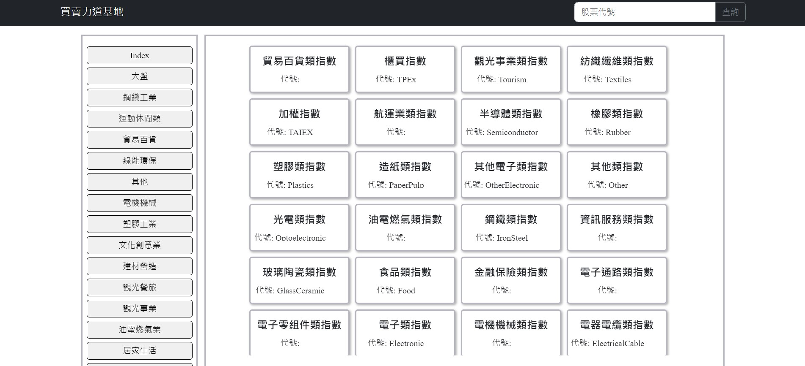

# ✨ 買賣力道比例基地

## 頁面截圖：

## 👋 功能說明

本專案是以[交易者的 E 甸園](https://ebigmoney.pixnet.net/blog/post/190418427)中分享的買賣地道比例工具製作而成。
使用者可以依股票類別、點擊卡片或直接搜尋進入線圖頁面。

備註:

## 👋 使用說明

1.  確認已經安裝 node.js 與 npm
2.  clone 專案
3.  終端機進入資料夾並輸入：`$ npm install `
4.  安裝完畢後，繼續輸入：`$ npm run start`

## 👋 開發工具

    "axios": "^1.4.0",
    "bootstrap": "^5.3.0",
    "clsx": "^1.2.1",
    "highcharts": "^11.1.0",
    "highcharts-react-official": "^3.2.0",
    "prop-types": "^15.8.1",
    "react": "^18.2.0",
    "react-bootstrap": "^2.7.4",
    "react-dom": "^18.2.0",
    "react-router-dom": "^6.13.0",
    "react-scripts": "5.0.1",
    "react-window": "^1.8.9",
    "sass": "^1.63.6",
